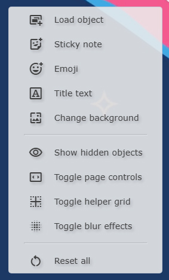
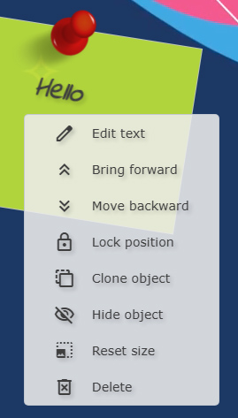

# Quick Display - for interactive whiteboards

A simple display webapp intended for SMART boards and educational interactive whiteboards - created by Mr L

## About

**Quick Display is fast at making pretty and functional classroom displays.**

Quick Display is a simple solution for teachers wanting to display notes, gifs, clocks, to-do lists, and more on a smartboard, without ugly user interfaces or visual clutter getting in the way.  QD runs in your favorite browser and lets you intuitively place and resize elements on a beautiful video or wallpaper background.

QD is written in Javascript and HTML.  It is open-source and shouldn't bother your school's IT person.

> [!IMPORTANT]
> This software is AI-free. Generative "artificial intelligence"/large-language models were not used in any way.

## Quick-start guide
1. Double click on the file `Quick Display.html`.  It will open in your default web browser.
2. Drag the tab containing QD over to your smartboard so the window is visible.
3. Press F11 on your keyboard to go into full screen mode.
4. Right click anywhere on the smartboard to get going!

## Adding objects
In the right-click menu, choose `Load object` to open the file picker.  Here you can add several different types of files.  Multiple file picking (by holding the shift/ctrl keys) is supported.
- Images and videos - most popular formats including animated and transparent types are supported.
- Text documents (.TXT) - text files are loaded as "notes" with a handwritten visual style.
- HTML files (.HTML) - these are loaded directly into the page.  With these you can build custom elements.  See the included Google Classroom and Slides buttons in the resources folder for examples.
- Scripts (.JS) - scripts allow you to modify the way the software behaves in a deep way.  Scripts can include custom elements, interactive tools, special effects, and more.

You can also quickly add sticky notes, emojis, and large text through the right click menu.  These objects have the same right click options as others and behave the same.

> [!NOTE]
> `Title text` option is not fully implemented - use `Load object` and choose `fancy text.js`.

Once an object is added, it usually appears as a draggable item that can be placed around the app as you like.  See below for more info on the ways you can interact with objects and scripts added to the page.

## Changing the background
In the right-click menu, choose `Change background` to open the file picker.  Here you can change the background with two different options:
- Images and videos - the selected media is stretched over the whole background and plays in a loop if animated.
- Scripts (.MJS) - scripts can give greater control over various ways the background appears.

> [!NOTE]
> Script backgrounds may not play nicely with each other and can cause glitches if not used carefully.

> [!NOTE]
> There is no functional difference between the JS files loaded with the `Add object` option and the MJS files loaded with the `Change background` option - both are simple Javascript.  The file extension tells QD whether the script is to be an object or a background.

## Interacting with objects

### Layering
Objects can stack in front of or behind each other.  Right-click on an object and use the `Bring forward` and `Move backward` buttons to adjust the order of objects in the stack.

### Positioning
You can prevent an object from moving by choosing the `Lock position` option.  `Allow moving` makes the object draggable again.

### Cloning
You can make a visual duplicate of an object by choosing `Clone object` in the right-click menu.

> [!NOTE]
> Cloned objects should be used for visuals only.  Associated scripts and actions may not work properly on a cloned object.

### Hiding
Right-click on an object and choose `Hide object` to make it disappear.  You can make it reappear at any point by choosing `Show hidden objects` in the main right-click menu.

### Resizing
Hover your mouse over an item and scroll the wheel to change its size.  You can right-click on the object and choose `Reset size` to set it back to normal.

### Deleting
Surprisingly, the `Delete` option in the right-click menu lets you delete an object.

### More actions
Many objects will have additional features and right-click options.
- images and videos allow you to add a hyperlink in their right-click menu.  Use this to set a link that can be opened by double-clicking on the item.
- scripts such as `fancy text.js` will let you edit the text content through the right-click menu.

## Page controls

QD supports arranging objects into basic pages.  Right-click anywhere on the background and choose `Toggle page controls` to show the page control buttons.  Switching pages will slide all objects according to their placement in the page order.  The background of QD will remain unchanged.

> [!NOTE]
> "Pages" work in QD by sliding all objects left or right by the width of your window.  You may experience bugs if you change resolutions.

> [!NOTE]
> Revealing hidden objects will only apply to objects on the current page.  Hidden objects on pages that are not visible will be unaffected.

## Helper grid

QD has a simple grid to divide the screen into thirds and sixths, for easier placement.  Right-click anywhere on the background and choose `Toggle helper grid` to reveal.

## Blur effects

Many translucent objects in QD can have a visual blur applied behind them.  Because computers at my school are ancient, this effect is disabled by default.  For faster computers, this effect can be enabled with the `Toggle blur effects` option.

## Included resources

Some helpful tools in the `resources` folder include:

- `add search options.js` - adds four easy search tools to your right click menu, including Youtube and Maps.
- `button - [..].html` - two sample buttons.  Open in any text editor to change them to go directly to your Classroom, slideshow, etc.
- `clock - analog.js` - an elegant clock face with adjustable transparency.
- `clock - digital.js` - a digital clock with some color/font formatting options.
- `clock - teaching tool.js` - an analog clock with hidden number values that can be revealed to help teach students.
- `fancy text.js` - formattable large text.  Has an animated rainbow option.
- `graph paper.js` - adjustable grid lines for your smartboard.
- `todo list.js` - a customizable to-do list.  Right-click or click underneath to add a new item.  Click on any time to check it off.  Drag items by the handles to reorder.
- `wallpaper - colors.mjs` - build your own color gradients for your background.  Allows blending with images/videos underneath.
- `web cam.js` - display the video from an attached camera.
- `window share.js` - display another window, tab, or app on your computer.

## Licensing and credits

> [!IMPORTANT]
> This software is in no way affiliated with any school division, school authority, provincial or state educational authority, or any other group.  This is the personal project of "Mr L".

LICENSE: You can do what you like with this code as long as:
- you release any derivative works for free
- you in no way use generative AI or large-language models to modify, edit, analyze, train, or otherwise interact with this code
- you are an individual user ONLY

This project makes use of the following libraries; each is the property of their respective authors.

- [jquery](https://jquery.com/)
- [Google Fonts](https://fonts.google.com/)
- [anime.js](https://animejs.com/)
- [three.js](https://threejs.org/)
- [EmojiPicker.js](https://pfurpass.github.io/EmojiPicker/)

> [!NOTE]
> This software is fully free.  If you like what I do and want to support educators and students, consider donating some money to an LGBTQ-friendly organization, such as [Egale Canada](https://egale.ca/donate/).  These organizations make life-saving differences for students with their research and advocacy.
